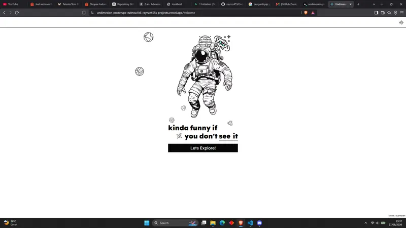

# UNDIMENSION

> Sebuah circle teman lama yang tak terikat ruang maupun waktu. Datang dari mimpi yang berbeda, namun melangkah di orbit yang sama. **Est. 2020.**

A neo-brutalist friend-circle profile web for 7 SMK friends ("Undimension"), built with Next.js 16, TypeScript, Tailwind CSS 4, and Prisma. Features 11 interactive sections, full keyboard navigation, dark/light/chaos themes, synthesized sound effects, and a cosmic aesthetic.



---

## ✨ Features

### Pages
- **Opening Screen** — Animated blackhole, orbiting planets, tesseract with astronaut image, retro boot sequence terminal
- **About** — 11 sections (see below)
- **Gallery of Chaos** — Paginated photo carousel with auto-advance + lightbox
- **Games** — 4 game sections (Minecraft, Roblox, Mobile Legends, D&D) with tape-deck carousels

### About Page Sections (11)
1. **Hero** — "WE ARE UNDIMENSION" with glitch-hover + THE MISSION card (gradient border, glow, corner frames)
2. **THE COLLECTIVE** — 7 members with photos, roles, RPG stats, fun facts, quotes + RANDOM ENTITY button
3. **STATS MATRIX** — Interactive radar chart comparing members' PWR/AGI/INT
4. **THE JOURNEY** — Timeline of 7 milestones (2020–2026)
5. **PLAY MATRIX** — Member × Game compatibility grid with hover detail
6. **HARAPAN KAMI** — 4 hope cards (Mimpi, Negeri, Kota, Masa Depan)
7. **MANIFESTO** — Bold typographic creed block
8. **COSMIC COORDINATES** — Interactive star map / constellation chart
9. **Quote + Chaos Dice** — Auto-rotating quotes + random member/activity generator
10. **MISSION CONTROL** — Live telemetry (time-since-2020, count-up stats from APIs)
11. **NEWS PORTAL** — DB-backed article feed with broadcast form
12. **GUESTBOOK** — DB-backed message wall with color-coded entries

### Interactive Features
- **Member Detail Modal** — Click any member → fullscreen dossier with tagline, quote, fun facts, stats, socials, share button
- **Photo Lightbox** — Click gallery photo → fullscreen viewer with ← → navigation
- **Keyboard Navigation** — `?` shortcuts, `G`/`S`/`A` page switch, `B` soundboard, konami code easter egg
- **Chaos Mode** — Third theme that randomizes accent colors site-wide
- **Soundboard** — Synthesized SFX (Web Audio API, no audio files)
- **Sound Effects** — Click/hover/open/close/submit/error sounds throughout
- **Deep Links** — `/#member-aldi` auto-opens that member's modal
- **Share Button** — Web Share API + clipboard fallback
- **Dark/Light Theme** — Via next-themes with localStorage persistence

### Backend (API Routes)
- `GET /api/members` — 7 members from DB
- `GET /api/gallery` — Photos (DB + static seed)
- `POST /api/gallery/upload` — Sharp WebP conversion (Render-ready)
- `GET/POST /api/news` — News articles
- `GET/POST /api/guestbook` — Guestbook entries
- `GET /api/games` — Game data

### Performance Optimizations
- CSS-only starfield (radial-gradient layers, ~100x lighter than DOM nodes)
- Scoped transitions (no global `*` transition)
- WebP images via sharp (85% smaller)
- `content-visibility: auto` for offscreen sections
- `will-change` on GPU animations
- rAF-throttled scroll handlers
- Lazy-loaded images with alt text

### Accessibility
- Skip-to-content link
- `role="dialog"` + `aria-modal` + focus trap on all modals
- ARIA labels on interactive elements
- Keyboard navigable (Tab, Enter, ESC, arrow keys)
- Respects `prefers-reduced-motion`

---

## 🛠 Tech Stack

| Layer | Technology |
|-------|-----------|
| Framework | Next.js 16 (App Router) |
| Language | TypeScript 5 |
| Styling | Tailwind CSS 4 + shadcn/ui |
| Database | Prisma ORM (SQLite dev / PostgreSQL prod) |
| Image Processing | sharp (WebP conversion) |
| Charts | recharts (radar chart) |
| Animation | framer-motion |
| Audio | Web Audio API (synthesized SFX) |
| Fonts | Bebas Neue, Outfit, Space Mono, Cinzel, Chakra Petch |

---

## 🚀 Getting Started

### Prerequisites
- Node.js 18+ or Bun
- A GitHub PAT (for pushing to repo)

### Installation

```bash
# Clone
git clone https://github.com/raynzz455/Undimesion-prototype.git
cd Undimesion-prototype

# Install dependencies
bun install

# Set up environment
cp .env.example .env
# Edit .env: DATABASE_URL="file:./db/custom.db"

# Push database schema
bun run db:push

# Seed database (7 members + 4 guestbook + 5 news articles)
bun run scripts/seed.ts
bun run scripts/seed-news.ts

# Start dev server
bun run dev
```

Open `http://localhost:3000` in your browser.

### Available Scripts

```bash
bun run dev          # Start dev server (port 3000)
bun run build        # Production build
bun run start        # Start production server
bun run lint         # Run ESLint
bun run db:push      # Push Prisma schema to DB
bun run db:generate  # Generate Prisma client
bun run db:migrate   # Run migrations
bun run db:reset     # Reset database
```

---

## 📁 Project Structure

```
src/
├── app/
│   ├── api/                    # API routes
│   │   ├── gallery/            # GET gallery + POST upload (sharp WebP)
│   │   ├── guestbook/          # GET/POST guestbook
│   │   ├── members/            # GET members
│   │   ├── news/               # GET/POST news articles
│   │   └── games/              # GET games
│   ├── globals.css             # Neo-brutalism CSS system + FX
│   ├── layout.tsx              # Root layout (fonts, providers)
│   └── page.tsx                # Main page (opening → nav → pages)
├── components/
│   ├── undimension/            # All Undimension components
│   │   ├── opening-screen.tsx
│   │   ├── nav-bar.tsx
│   │   ├── about-page.tsx
│   │   ├── memories-page.tsx   # Gallery with paginated carousel
│   │   ├── games-page.tsx
│   │   ├── member-detail-modal.tsx
│   │   ├── photo-lightbox.tsx
│   │   ├── timeline-section.tsx
│   │   ├── stats-radar-section.tsx
│   │   ├── compatibility-matrix.tsx
│   │   ├── cosmic-star-map.tsx
│   │   ├── chaos-dice.tsx
│   │   ├── news-portal.tsx
│   │   ├── mission-control.tsx
│   │   ├── guestbook-section.tsx
│   │   ├── quote-widget.tsx
│   │   ├── manifesto-section.tsx
│   │   ├── soundboard.tsx
│   │   ├── keyboard-shortcuts-overlay.tsx
│   │   ├── chaos-provider.tsx
│   │   └── ...
│   └── ui/                     # shadcn/ui components
├── hooks/
│   ├── use-fetch.ts            # Lightweight fetch hook
│   ├── use-sfx.ts              # Web Audio SFX + konami code
│   ├── use-focus-trap.ts       # Modal focus trap
│   ├── use-scroll-reveal.ts    # IntersectionObserver reveal
│   └── use-hash-member.ts      # Deep-link hash listener
├── lib/
│   ├── undimension/data.ts     # Members, timeline, quotes, etc.
│   └── db.ts                   # Prisma client
└── prisma/
    └── schema.prisma           # Member, GalleryPhoto, GuestbookEntry, NewsArticle
```

---

## 🎨 Design System

### Color Palette
| Color | Hex | Usage |
|-------|-----|-------|
| Red | `#ff4d4d` | Primary accent |
| Cyan | `#00e5ff` | Secondary accent |
| Lime | `#d4ff00` | Highlight / active |
| Magenta | `#ff00ff` | Chaos / special |
| Orange | `#ff8c00` | Warning |
| Green | `#00ff00` | Success / boot |
| Purple | `#8a2be2` | Energy |
| Ink | `#09090b` | Background (dark) |
| Paper | `#f4f4f0` | Background (light) |

### CSS Utilities (in globals.css)
- `.ud-glitch` / `.ud-glitch-hover` — RGB-split glitch text
- `.ud-reveal` — Scroll reveal (IntersectionObserver)
- `.ud-tape` / `.ud-stamp-circle` — Washi tape + rubber stamp decorations
- `.ud-press` — Brutalist button-press effect
- `.ud-grain` — SVG noise film-grain overlay
- `.ud-tilt` — 3D perspective hover tilt
- `.ud-corners` — L-shaped viewfinder brackets
- `.ud-crt` — CRT scanlines + vignette
- `.ud-grad-border` — Animated gradient border
- `.ud-glow` — Pulsing box-shadow glow

---

## 🚢 Deployment (Render)

### Prerequisites
1. A Render account
2. A PostgreSQL database (Render's managed Postgres or external)
3. Cloud storage for images (Cloudinary / Uploadthing / S3)

### Steps

1. **Fork/push this repo to GitHub**

2. **Create a new Web Service on Render**
   - Build Command: `bun install && bun run db:push`
   - Start Command: `bun run start`

3. **Set Environment Variables**
   ```
   DATABASE_URL=postgresql://...     # Your Postgres URL
   NODE_ENV=production
   ```

4. **Swap image storage to cloud** (in `src/app/api/gallery/upload/route.ts`)
   - Replace the local `writeFileSync` with Cloudinary/Uploadthing upload
   - The DB stores the final URL, so the frontend doesn't change

5. **Deploy!**

---

## 🧪 Testing

```bash
# Lint
bun run lint

# Manual QA via agent-browser
agent-browser open http://localhost:3000/
agent-browser snapshot -i
```

---

## 📜 License

This is a personal project for the Undimension collective. Not for commercial use.

---

## 👥 The Collective (7 Members)

| Nick | Role | Element |
|------|------|---------|
| Aldi | THE FOUNDER | FIRE |
| Rembo | THE ARCHITECT | ICE |
| Eja | THE STRATEGIST | MIND |
| Byan | THE VANGUARD | STORM |
| Acong | THE MAVERICK | CHAOS |
| Tipki | THE ENIGMA | VOID |
| Dudit | THE CATALYST | ENERGY |

---

> **One orbit. One gravity. No limits.**
> Built with chaos · Powered by bonds · Est. 2020
